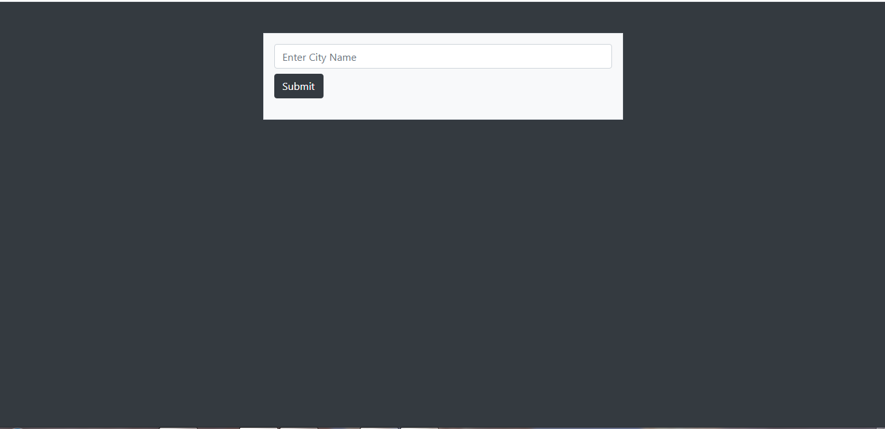
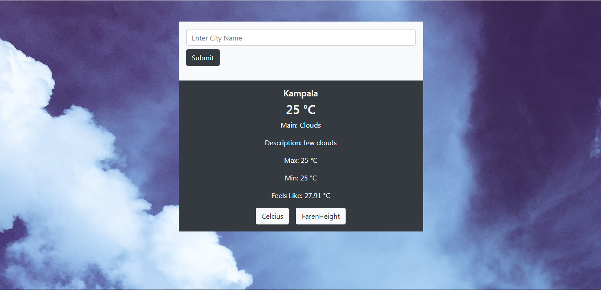
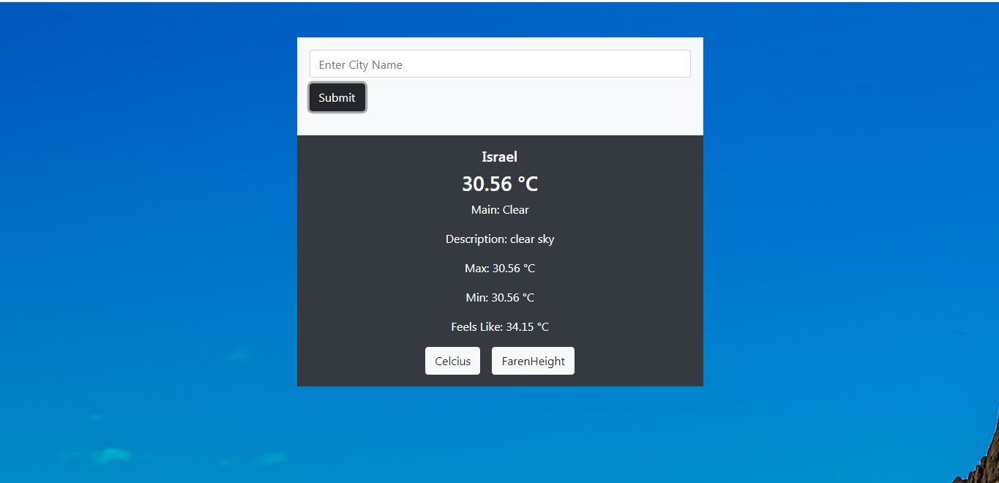

# WEATHER APP

## Description

In this project I built a simple weather app showcasing the use of promises while working with asynchronous javaScript.

## FEATURES

- Enter the city name whose weahter info you need in the input field
- Click submit or press enter to view the weather details

## Home page

## Cloudy weather

## Clear weather

## Built With

- Html5
- CSS3
- Bootstrap
- JavaScript
- Webpack
- Weathermap API

## Live Demo

[Live Demo Link]()

## Getting Started

To get a local copy up and running follow these simple example steps.

### Prerequisites

- Node

## Instructions

- git clone https://github.com/frankopkusianwar/weather-app.git
- cd weather-app
- npm install
- npm start

### Usage

- Now you can request for any city's weather details.

## Author

👤 **Okiror Frank**

- Github: [@frankopkusianwar](https://github.com/frankopkusianwar)
- Twitter: [@franko0781](https://twitter.com/franko0781)
- Linkedin: [Okiror Frank](https://linkedin.com/in/frank-okiror)
- Email: okirorfrank3@gmail.com

## 🤝 Contributing

Contributions, issues and feature requests are welcome!

Feel free to check the [issues page](issues/).

## Show your support

Give a ⭐️ if you like this project!

## Acknowledgments

- Microverse, standup team and the microverse community for helping build the skills that were used on this project

## 📝 License

This project is [MIT](lic.url) licensed.
